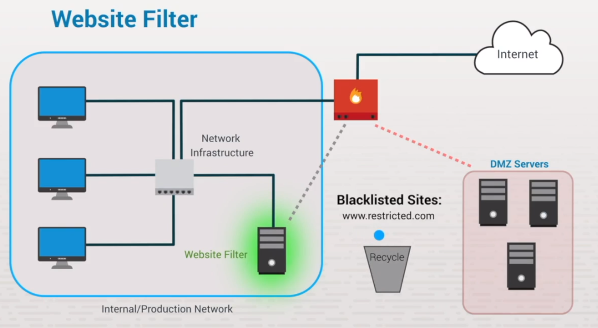
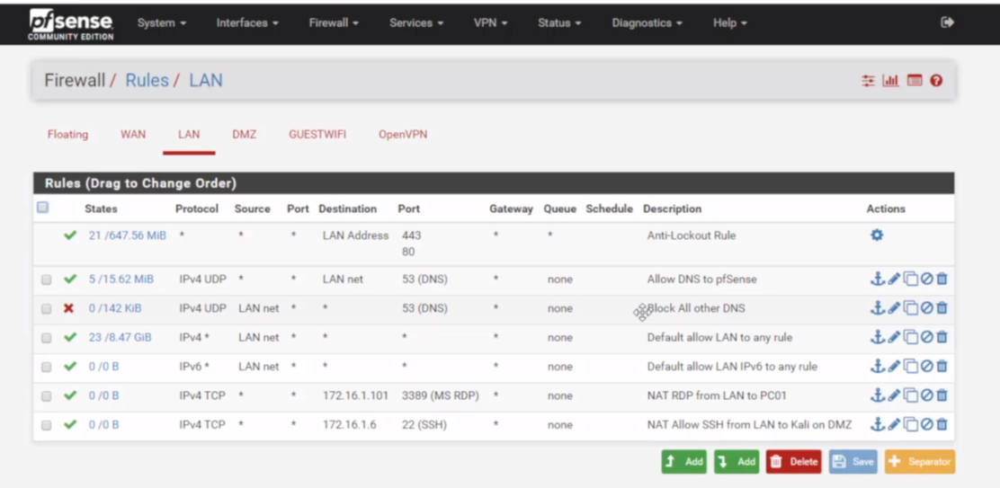
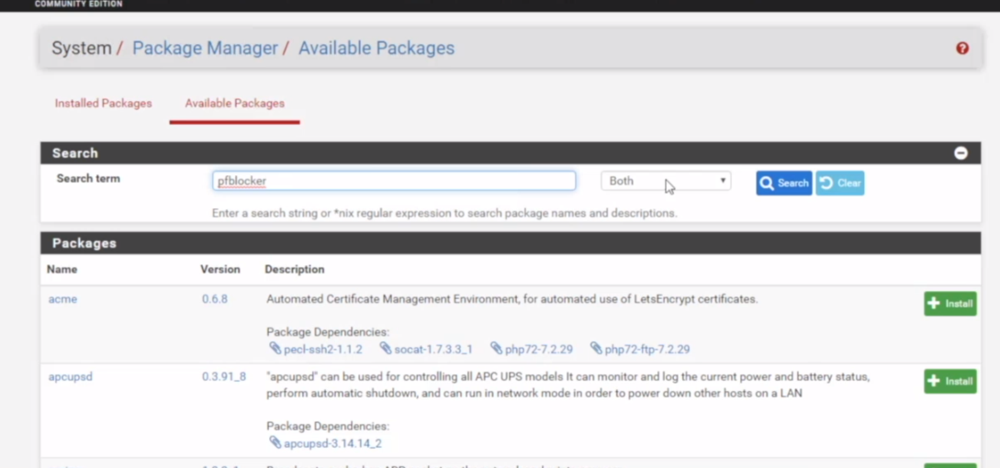
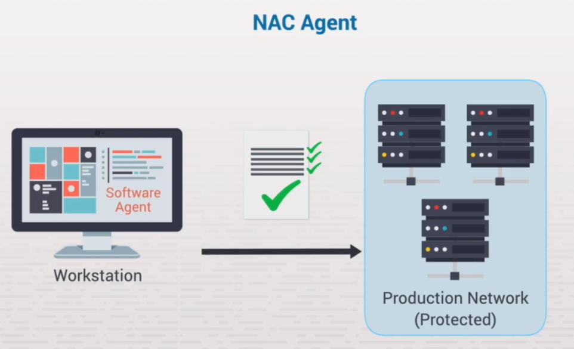

# Devices & Infrastructure

## 5.4 NAT

Network address translation occurs due to a limitation in the IPv4 networking scheme. The interent is a public network and needs a routable IP that is registered. Not all devices can have one - ISPs will provide this to a customer.

The router will assign each device on the internal network with a unique IP that is then converted into a routable IP once it leaves the LAN to go into the WAN.

## 5.5 VPN
A virtual private network VPN is a remote-access connection that uses encryption

Use IPSec over L2TP - PPTP with MSv2CHAP is insecure!

## 5.6 Web Threat Protection

### Threat types
- Mass emails
- Bad links
- Nefarious websites

Web threat devices;
- save money, time and reportaiton
- hardware-based devices (either All in one / Unified Threat Protection)
- DMZ or internal netowrk
- Policy driven

### Types of Protection Devices

Website/URL content filtering - prevents a user from visiting restricted websites. Specific websites are identified as restricted; employees are not able to view the sites on their browsers. Used to enforce the organization's internet usage policy. Helps to increase bandwidth availability. Does not protect against malcious sites.

===
Web threat filtering - prevents a user from visiting websites with known malicious content. It maintains a list of websites with known malicious content.

Gateway email spam filters - prevent spam emails from reaching your network, servers, and computers. Spam filters can be configured to block specific senders, emails containing threats (such as false links), and emails containing specific content.

Virus scanners - identify infected content and dispose of it. Often coupled with email scanners.

Anti-phishing software- scans content to identify and dispose of phishing attempts, preventing outside attempts to access confidential information.

Encryption - causes data, such as the content of an email, to be unintelligible except to those who have the proper key to decrypt it.
Proxies	
- Transparent proxies are located between a user and the internet, and they can redirect requests without changing the request.
- Forward proxies can be used to filter web content, but can also be used to mask a user's identity for anonymity.

### Blocking sites via pfSense

Add packages

## 5.7 Network access control

- Network access control - A policy-driven control process that allows or denies network access to devices connecting to a network.
- Bring your own device -	A policy that allows an employee to use a personal device, such as a laptop computer or phone, to connect to the organization's network to accomplish daily work tasks.

Can be used to setup admission criteria to the network - if a device does not satisfy a certain criteria it will be placeed onto a restricted network until issues are resolved (device has access to updates and other necessary things to make it conform to the network).

NAC Goals are to prevent zero-day attacks, give role-based controls, encrypt traffic and manage identity / enforce policies.

---
## 5.8 Network Threats Facts

Network segmentation - secure network-architecture concept. Idea is that if certain parts of a system are compromised, then the rest of the network is okay. Makes it much easier to identify suspicious network traffic.

Most common method is to setup VLANS (Virtual Local Area Networks) - separate these into zones (low, medium, high), etc.  Example of a low-trust zone could be a web server. This kind of zone is also referred to as a DMZ, or demilitarized zone.

Types of network attack
- Active : are when perpetrators attempt to compromise or affect the operations of a system in some way. 
- Passive : occur when perpetrators attempt to gather information without affecting the flow of that information from the targeted network. 
- External
- Inside : people inside the network security perimeter

User Education and Training

training is very important - phishing is a big concern, therefore educating an organisations employees is beneficial.

Threat focus points

- Entry points - regonise possible entry points for attacks. Public servers, WIFI, personal devices tc.
- Inherent vulnerabilities - systems that lack proper security controls (older versions of Windows / other SW)
- Documentation - document all asssets to ensure you are securing ===EVERYTHING===.
- Network baseline - identify a normal pattern of usage (server load, net activity etc) so you can detect anomolies or atypical usage.

- [Cyber-Security Files](https://github.com/mrteasdale-cs/mrteasdale-cs.github.io/tree/d103ce5b0975c6c9305582da1397c7e0ebe45c07/programming/cyber-security){:target="_blank"}