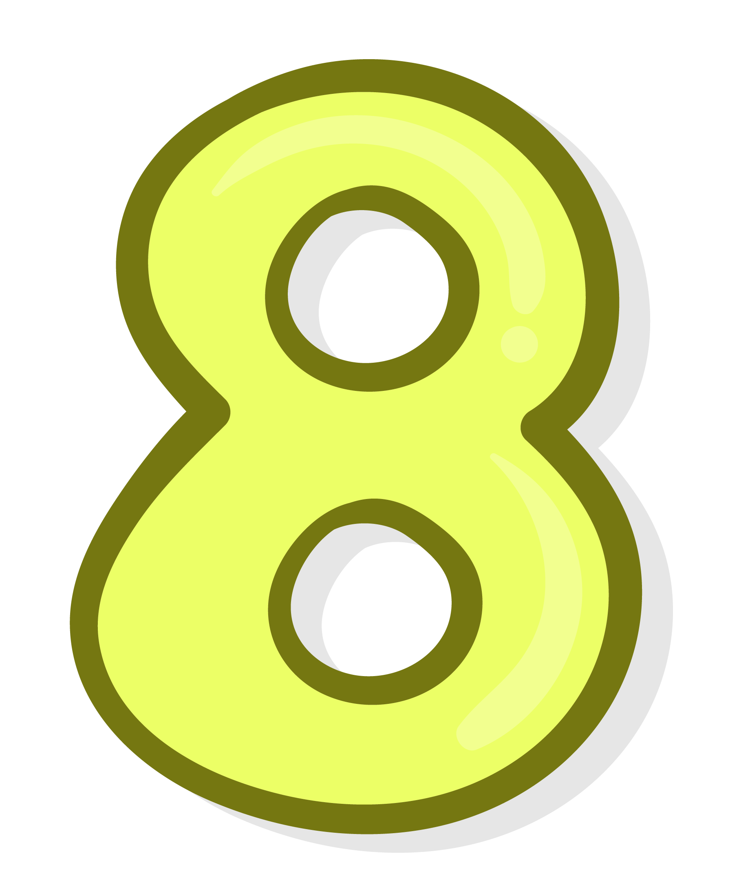

<div style="text-align:center; margin-bottom:32px;">
  <h1 style="font-size:2em; font-weight:700;">Welcome to My Computer Science Learning Hub!</h1>
  <p></p>
  <a href="https://mrteasdale.com" target="_blank" style="font-size: 1.3em; font-weight: 500; color: #2a7ae2;">Visit My Main Website &rarr;</a>
</div>

<div style="display:flex; flex-wrap: wrap; gap: 2em; justify-content:center;">
  <a href="./year78.html" class="card">
    <div class="card-box" style="background:#253a53; border-radius:16px; padding:24px; width:300px; box-shadow:0 0 15px #dbeafe; text-align:center;">
      
      <h2 style="margin:16px 0 0 0; font-size:1.4em;">Grade 7/8 <br> KS3 Computer Science</h2>
    </div>
  </a>
  <a href="./year910.html" class="card">
    <div class="card-box" style="background:#163261; border-radius:16px; padding:24px; width:300px; box-shadow:0 0 15px #c7d2fe; text-align:center;">
      
      <h2 style="margin:16px 0 0 0; font-size:1.4em;">Grade 9/10 <br> GCSE Computer Science</h2>
    </div>
  </a>
  <a href="./alevel_cs.html" class="card">
    <div class="card-box" style="background:#334721; border-radius:16px; padding:24px; width:300px; box-shadow:0 0 15px #bef264; text-align:center;">
      
      <h2 style="margin:16px 0 0 0; font-size:1.4em;">Grade 11/12 <br> A Level Computer Science</h2>
    </div>
  </a>
  <a href="./ibcs/index.html" class="card">
    <div class="card-box" style="background:#603d0b; border-radius:16px; padding:24px; width:300px; box-shadow:0 0 15px #fcd34d; text-align:center;">
      
      <h2 style="margin:16px 0 0 0; font-size:1.4em;">Grade 11/12 <br> IB Computer Science</h2>
    </div>
  </a>
  <a href="./cyber-security.html" class="card">
    <div class="card-box" style="background:#452359; border-radius:16px; padding:24px; width:300px; box-shadow:0 0 15px #e9d5ff; text-align:center;">
      
      <h2 style="margin:16px 0 0 0; font-size:1.4em;">Cybersecurity (Sec+)</h2>
    </div>
  </a>
  <a href="./coding_challenges.html" class="card">
    <div class="card-box" style="background:#0f4653; border-radius:16px; padding:24px; width:300px; box-shadow:0 0 15px #bae6fd; text-align:center;">
      
      <h2 style="margin:16px 0 0 0; font-size:1.4em;">Coding Challenges</h2>
    </div>
  </a>
</div>

<div style="margin:42px auto 16px auto; max-width:700px; background:#000000; padding:24px 32px; border-radius:20px; box-shadow:0 0 10px #ede9fe;">
  <h3 style="text-align:center;">Example Python Script: Palindrome Checker</h3>

```python
# Code to check if a string or number is a Palindrome.
class Solution:
    def isPalindrome(self, x: int):
        new_X = str(x)
        if new_X == new_X[::-1]:
            return True
        else:
            return False

check = 1223221
output = Solution()
print(output.isPalindrome(check))
```
</div>

<div style="margin:32px 0; text-align:center;">
  <h3>Want to play a game?</h3>
  <iframe height = "450" width = "660" src="https://editor.p5js.org/mrteasdale-cs/full/e9IQnrqdU" style="border-radius:20px; box-shadow:0 0 15px #d1fae5; margin: 0 auto;"></iframe>
</div>
